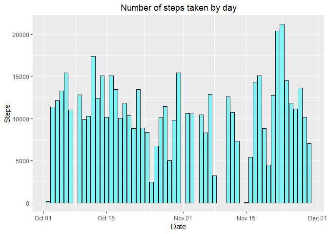
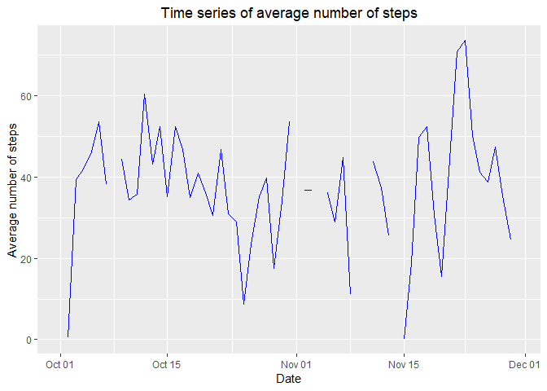
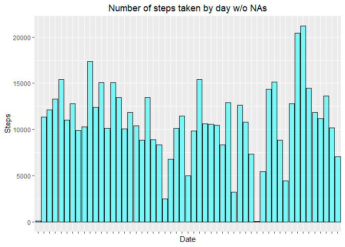
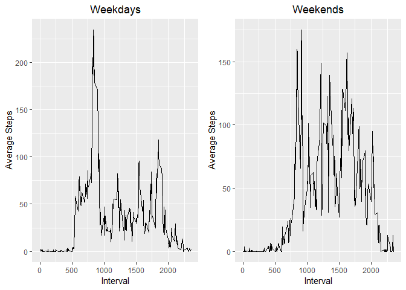

## Loading and preprocessing the data

Unzip data file and read it as data frame 'activity'


```r
unzip("activity.zip")
activity <- read.csv("activity.csv", stringsAsFactors = FALSE)
activity$date <- as.Date(activity$date)
```

Take a look at 'activity'

```r
head(activity)
```

```
##   steps       date interval
## 1    NA 2012-10-01        0
## 2    NA 2012-10-01        5
## 3    NA 2012-10-01       10
## 4    NA 2012-10-01       15
## 5    NA 2012-10-01       20
## 6    NA 2012-10-01       25
```

## What is mean total number of steps taken per day?

Aggregate data for number of steps taken each day


```r
library(dplyr)
selected_data <- activity %>%
        select(date, steps)
agg_data <- selected_data %>%
        group_by(date) %>%
                summarise(total_steps = sum(steps))
```

### Barplot of number of steps taken each day


```r
library(ggplot2)
ggplot(data = agg_data, aes(x = date, y = total_steps)) +
        geom_bar(stat = "identity", fill = "cyan", color = "black", alpha = 0.5) +
                labs(x = "Date", y = "Steps", title = "Number of steps taken by day") + 
                        theme(plot.title = element_text(hjust = 0.5))
```

<!-- -->

### Average number of steps for each day


```r
selected_data <- activity %>%
        select(date, steps)
agg_data <- selected_data %>%
        group_by(date) %>%
                summarise(mean_steps = mean(steps, na.rm = TRUE), median_steps = median(steps, na.rm = TRUE))
agg_data$date <- as.character(agg_data$date)
```

Print as a table


```r
library(xtable)
print(xtable(agg_data), type = "html")
```

<!-- html table generated in R 3.5.1 by xtable 1.8-3 package -->
<!-- Sat Dec 15 13:10:16 2018 -->
<table border=1>
<tr> <th>  </th> <th> date </th> <th> mean_steps </th> <th> median_steps </th>  </tr>
  <tr> <td align="right"> 1 </td> <td> 2012-10-01 </td> <td align="right">  </td> <td align="right">  </td> </tr>
  <tr> <td align="right"> 2 </td> <td> 2012-10-02 </td> <td align="right"> 0.44 </td> <td align="right"> 0.00 </td> </tr>
  <tr> <td align="right"> 3 </td> <td> 2012-10-03 </td> <td align="right"> 39.42 </td> <td align="right"> 0.00 </td> </tr>
  <tr> <td align="right"> 4 </td> <td> 2012-10-04 </td> <td align="right"> 42.07 </td> <td align="right"> 0.00 </td> </tr>
  <tr> <td align="right"> 5 </td> <td> 2012-10-05 </td> <td align="right"> 46.16 </td> <td align="right"> 0.00 </td> </tr>
  <tr> <td align="right"> 6 </td> <td> 2012-10-06 </td> <td align="right"> 53.54 </td> <td align="right"> 0.00 </td> </tr>
  <tr> <td align="right"> 7 </td> <td> 2012-10-07 </td> <td align="right"> 38.25 </td> <td align="right"> 0.00 </td> </tr>
  <tr> <td align="right"> 8 </td> <td> 2012-10-08 </td> <td align="right">  </td> <td align="right">  </td> </tr>
  <tr> <td align="right"> 9 </td> <td> 2012-10-09 </td> <td align="right"> 44.48 </td> <td align="right"> 0.00 </td> </tr>
  <tr> <td align="right"> 10 </td> <td> 2012-10-10 </td> <td align="right"> 34.38 </td> <td align="right"> 0.00 </td> </tr>
  <tr> <td align="right"> 11 </td> <td> 2012-10-11 </td> <td align="right"> 35.78 </td> <td align="right"> 0.00 </td> </tr>
  <tr> <td align="right"> 12 </td> <td> 2012-10-12 </td> <td align="right"> 60.35 </td> <td align="right"> 0.00 </td> </tr>
  <tr> <td align="right"> 13 </td> <td> 2012-10-13 </td> <td align="right"> 43.15 </td> <td align="right"> 0.00 </td> </tr>
  <tr> <td align="right"> 14 </td> <td> 2012-10-14 </td> <td align="right"> 52.42 </td> <td align="right"> 0.00 </td> </tr>
  <tr> <td align="right"> 15 </td> <td> 2012-10-15 </td> <td align="right"> 35.20 </td> <td align="right"> 0.00 </td> </tr>
  <tr> <td align="right"> 16 </td> <td> 2012-10-16 </td> <td align="right"> 52.38 </td> <td align="right"> 0.00 </td> </tr>
  <tr> <td align="right"> 17 </td> <td> 2012-10-17 </td> <td align="right"> 46.71 </td> <td align="right"> 0.00 </td> </tr>
  <tr> <td align="right"> 18 </td> <td> 2012-10-18 </td> <td align="right"> 34.92 </td> <td align="right"> 0.00 </td> </tr>
  <tr> <td align="right"> 19 </td> <td> 2012-10-19 </td> <td align="right"> 41.07 </td> <td align="right"> 0.00 </td> </tr>
  <tr> <td align="right"> 20 </td> <td> 2012-10-20 </td> <td align="right"> 36.09 </td> <td align="right"> 0.00 </td> </tr>
  <tr> <td align="right"> 21 </td> <td> 2012-10-21 </td> <td align="right"> 30.63 </td> <td align="right"> 0.00 </td> </tr>
  <tr> <td align="right"> 22 </td> <td> 2012-10-22 </td> <td align="right"> 46.74 </td> <td align="right"> 0.00 </td> </tr>
  <tr> <td align="right"> 23 </td> <td> 2012-10-23 </td> <td align="right"> 30.97 </td> <td align="right"> 0.00 </td> </tr>
  <tr> <td align="right"> 24 </td> <td> 2012-10-24 </td> <td align="right"> 29.01 </td> <td align="right"> 0.00 </td> </tr>
  <tr> <td align="right"> 25 </td> <td> 2012-10-25 </td> <td align="right"> 8.65 </td> <td align="right"> 0.00 </td> </tr>
  <tr> <td align="right"> 26 </td> <td> 2012-10-26 </td> <td align="right"> 23.53 </td> <td align="right"> 0.00 </td> </tr>
  <tr> <td align="right"> 27 </td> <td> 2012-10-27 </td> <td align="right"> 35.14 </td> <td align="right"> 0.00 </td> </tr>
  <tr> <td align="right"> 28 </td> <td> 2012-10-28 </td> <td align="right"> 39.78 </td> <td align="right"> 0.00 </td> </tr>
  <tr> <td align="right"> 29 </td> <td> 2012-10-29 </td> <td align="right"> 17.42 </td> <td align="right"> 0.00 </td> </tr>
  <tr> <td align="right"> 30 </td> <td> 2012-10-30 </td> <td align="right"> 34.09 </td> <td align="right"> 0.00 </td> </tr>
  <tr> <td align="right"> 31 </td> <td> 2012-10-31 </td> <td align="right"> 53.52 </td> <td align="right"> 0.00 </td> </tr>
  <tr> <td align="right"> 32 </td> <td> 2012-11-01 </td> <td align="right">  </td> <td align="right">  </td> </tr>
  <tr> <td align="right"> 33 </td> <td> 2012-11-02 </td> <td align="right"> 36.81 </td> <td align="right"> 0.00 </td> </tr>
  <tr> <td align="right"> 34 </td> <td> 2012-11-03 </td> <td align="right"> 36.70 </td> <td align="right"> 0.00 </td> </tr>
  <tr> <td align="right"> 35 </td> <td> 2012-11-04 </td> <td align="right">  </td> <td align="right">  </td> </tr>
  <tr> <td align="right"> 36 </td> <td> 2012-11-05 </td> <td align="right"> 36.25 </td> <td align="right"> 0.00 </td> </tr>
  <tr> <td align="right"> 37 </td> <td> 2012-11-06 </td> <td align="right"> 28.94 </td> <td align="right"> 0.00 </td> </tr>
  <tr> <td align="right"> 38 </td> <td> 2012-11-07 </td> <td align="right"> 44.73 </td> <td align="right"> 0.00 </td> </tr>
  <tr> <td align="right"> 39 </td> <td> 2012-11-08 </td> <td align="right"> 11.18 </td> <td align="right"> 0.00 </td> </tr>
  <tr> <td align="right"> 40 </td> <td> 2012-11-09 </td> <td align="right">  </td> <td align="right">  </td> </tr>
  <tr> <td align="right"> 41 </td> <td> 2012-11-10 </td> <td align="right">  </td> <td align="right">  </td> </tr>
  <tr> <td align="right"> 42 </td> <td> 2012-11-11 </td> <td align="right"> 43.78 </td> <td align="right"> 0.00 </td> </tr>
  <tr> <td align="right"> 43 </td> <td> 2012-11-12 </td> <td align="right"> 37.38 </td> <td align="right"> 0.00 </td> </tr>
  <tr> <td align="right"> 44 </td> <td> 2012-11-13 </td> <td align="right"> 25.47 </td> <td align="right"> 0.00 </td> </tr>
  <tr> <td align="right"> 45 </td> <td> 2012-11-14 </td> <td align="right">  </td> <td align="right">  </td> </tr>
  <tr> <td align="right"> 46 </td> <td> 2012-11-15 </td> <td align="right"> 0.14 </td> <td align="right"> 0.00 </td> </tr>
  <tr> <td align="right"> 47 </td> <td> 2012-11-16 </td> <td align="right"> 18.89 </td> <td align="right"> 0.00 </td> </tr>
  <tr> <td align="right"> 48 </td> <td> 2012-11-17 </td> <td align="right"> 49.79 </td> <td align="right"> 0.00 </td> </tr>
  <tr> <td align="right"> 49 </td> <td> 2012-11-18 </td> <td align="right"> 52.47 </td> <td align="right"> 0.00 </td> </tr>
  <tr> <td align="right"> 50 </td> <td> 2012-11-19 </td> <td align="right"> 30.70 </td> <td align="right"> 0.00 </td> </tr>
  <tr> <td align="right"> 51 </td> <td> 2012-11-20 </td> <td align="right"> 15.53 </td> <td align="right"> 0.00 </td> </tr>
  <tr> <td align="right"> 52 </td> <td> 2012-11-21 </td> <td align="right"> 44.40 </td> <td align="right"> 0.00 </td> </tr>
  <tr> <td align="right"> 53 </td> <td> 2012-11-22 </td> <td align="right"> 70.93 </td> <td align="right"> 0.00 </td> </tr>
  <tr> <td align="right"> 54 </td> <td> 2012-11-23 </td> <td align="right"> 73.59 </td> <td align="right"> 0.00 </td> </tr>
  <tr> <td align="right"> 55 </td> <td> 2012-11-24 </td> <td align="right"> 50.27 </td> <td align="right"> 0.00 </td> </tr>
  <tr> <td align="right"> 56 </td> <td> 2012-11-25 </td> <td align="right"> 41.09 </td> <td align="right"> 0.00 </td> </tr>
  <tr> <td align="right"> 57 </td> <td> 2012-11-26 </td> <td align="right"> 38.76 </td> <td align="right"> 0.00 </td> </tr>
  <tr> <td align="right"> 58 </td> <td> 2012-11-27 </td> <td align="right"> 47.38 </td> <td align="right"> 0.00 </td> </tr>
  <tr> <td align="right"> 59 </td> <td> 2012-11-28 </td> <td align="right"> 35.36 </td> <td align="right"> 0.00 </td> </tr>
  <tr> <td align="right"> 60 </td> <td> 2012-11-29 </td> <td align="right"> 24.47 </td> <td align="right"> 0.00 </td> </tr>
  <tr> <td align="right"> 61 </td> <td> 2012-11-30 </td> <td align="right">  </td> <td align="right">  </td> </tr>
   </table>

## What is the average daily activity pattern?

Aggregate average number of steps per day


```r
selected_data <- activity %>%
        select(date, steps)
agg_data <- selected_data %>%
        group_by(date) %>%
                summarise(mean_steps = mean(steps, na.rm = TRUE))
```

Plot time series
             

```r
ggplot(data = agg_data, aes(x = date, y = mean_steps)) +
        geom_line(color = "blue") +
                labs(x = "Date", y = "Average number of steps", title = "Time series of average number of steps") +
                        theme(plot.title = element_text(hjust = 0.5))
```

<!-- -->

### The 5-minute interval that, on average, contains the maximum number of steps


```r
selected_data <- activity %>%
        filter(steps == max(steps, na.rm = TRUE)) %>%
                select(date, interval)
selected_data
```

```
##         date interval
## 1 2012-11-27      615
```

## Imputing missing values


```r
imputed_data <- activity[complete.cases(activity), ]
```

### Histogram of the total number of steps taken each day after missing values are imputed

Aggregate data for number of steps taken each day


```r
imputed_data$date <- as.character(imputed_data$date)
selected_data <- imputed_data %>%
        select(date, steps)
agg_data <- selected_data %>%
        group_by(date) %>%
                summarise(total_steps = sum(steps))
```

Barplot of number of steps taken each day


```r
ggplot(data = agg_data, aes(x = date, y = total_steps)) +
        geom_bar(stat = "identity", fill = "cyan", color = "black", alpha = 0.5) +
                labs(x = "Date", y = "Steps", title = "Number of steps taken by day w/o NAs") + 
                        theme(plot.title = element_text(hjust = 0.5), axis.text.x = element_blank())
```

<!-- -->

## Are there differences in activity patterns between weekdays and weekends?


```r
wdays <- c("Monday", "Tuesday", "Wednesday", "Thursday", "Friday")
wends <- c("Saturday", "Sunday")

wday_activity <- activity %>%
        filter(weekdays(date) %in% wdays)

wend_activity <- activity %>%
        filter(weekdays(date) %in% wends)

selected_wday <- wday_activity %>%
        select(interval, steps)

agg_wday <- selected_wday %>%
        group_by(interval) %>%
                summarise(average_steps_wday = mean(steps, na.rm = TRUE))

selected_wend <- wend_activity %>%
        select(interval, steps)

agg_wend <- selected_wend %>%
        group_by(interval) %>%
        summarise(average_steps_wend = mean(steps, na.rm = TRUE))

agg_data <- merge(agg_wday, agg_wend, by.x = "interval", by.y = "interval")

plot_wday <- ggplot(data = agg_data, aes(x = interval, y = average_steps_wday)) +
        geom_line() +
                labs(x = "Interval", y = " Average Steps", title = "Weekdays") +
                        theme(plot.title = element_text(hjust = 0.5))

plot_wend <- ggplot(data = agg_data, aes(x = interval, y = average_steps_wend)) +
        geom_line() +
                labs(x = "Interval", y = " Average Steps", title = "Weekends") +
                        theme(plot.title = element_text(hjust = 0.5))

library(gridExtra)
grid.arrange(plot_wday, plot_wend, ncol = 2)
```

<!-- -->
